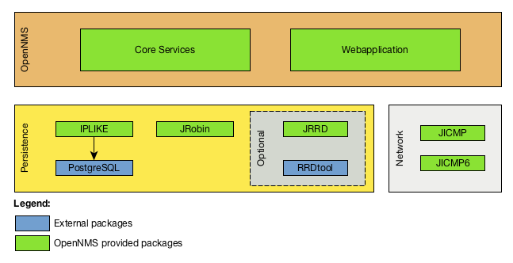

== Components to install OpenNMS
The network management platform _OpenNMS_ has different components to install.

 * Persistence of node information, alarms and events in _PostgreSQL_ database
 * Webapplication and core daemons for monitorig in a Java Runtime Environment
 * Persistence of long term performance data in _RRDtool_ or _JRobin_ format

.Components to install _OpenNMS_

 * *_Core Services_*: Main OpenNMS services for network management tasks like service assurance, performance data collection and centralized logging
 * *_Webapplication_*: OpenNMS Webapplication for users and administrators
 * *_IPLIKE_*: Optimized stored procedure in _PostgreSQL_ for access IP address data types
 * *_PostgreSQL_*: _RDBMS_ for persisting events, alarms, node information and generic monitoring information
 * *_JRobin_*: Pure _Java_ based time series database
 * *_JRRD_* (optional): Required as alternative to _JRobin_ it is possible to use native _RRDtool_, _JRRD_ is the Java interface to _RRDtool_
 * *_RRDtool_* (optional): Instead of _JRobin_ it is possible to use native _RRDtool_ implementation
 * *_JICMP_* and *_JICMP6_*: Packages as interface for _ICMP_ in IPv4 and IPv6 protocol.

Before we start with the installation of _OpenNMS_ it requires a _Java_ and _PostgreSQL_ environment.
The application _OpenNMS_ has _RPM_ and _Debian_ package repositories with different releases as pre-compiled packages.
