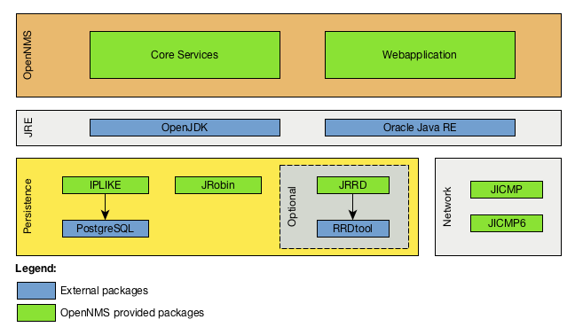

// This is a generic Opearting System independent overiew.

== Basic Components to Install OpenNMS
The network management platform _OpenNMS_ gives the possibility to run different task in monitoring a network.
The installation can be divided in the following components:

 * *_Java Runtime Environment (JRE)_* running the Webapplication and core daemons for monitoring
 * *_PostgreSQL_*: database for inventory, assets and monitoring information like alarms, notifications and monitoring events
 * *_Core Services_*: Main OpenNMS services for network management tasks like service assurance, performance data collection and centralized logging
 * *_Webapplication_*: OpenNMS Webapplication for users and administrators
 * *_IPLIKE_*: Optimized stored procedure in _PostgreSQL_ for access IP address data types
 * *_JRRD_* or *_RRDtool_*: to persist long term time series data for performance and system metrics
 * *_JICMP_* and *_JICMP6_*: Packages providing _ICMP_ in IPv4 and IPv6 protocol to _OpenNMS_.

.Components to install _OpenNMS_

